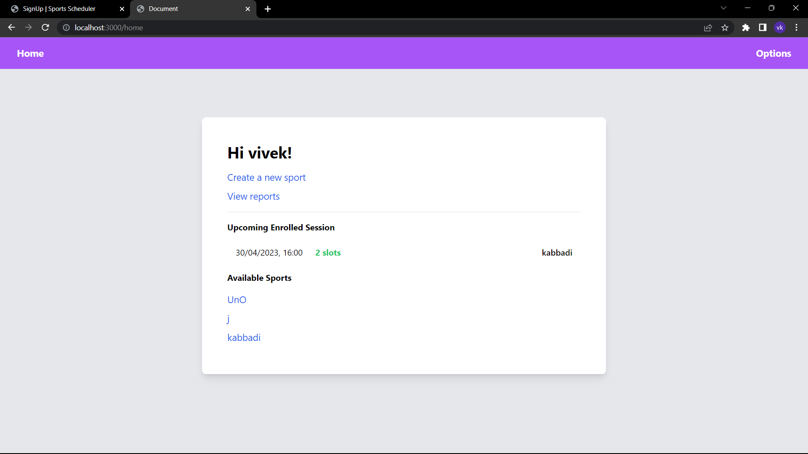
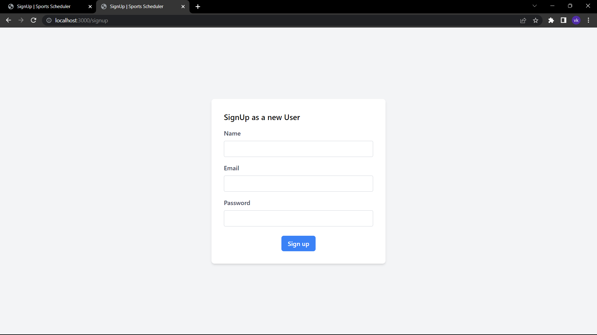
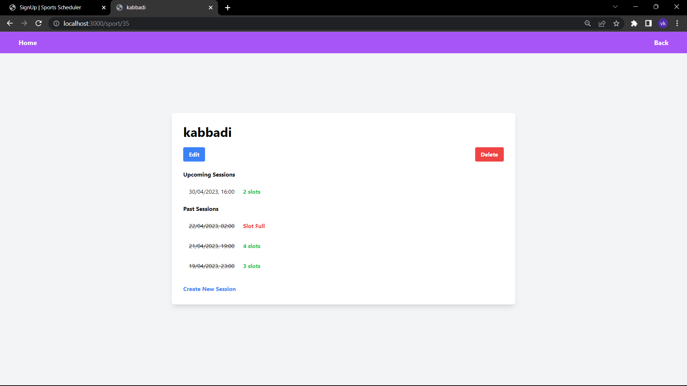
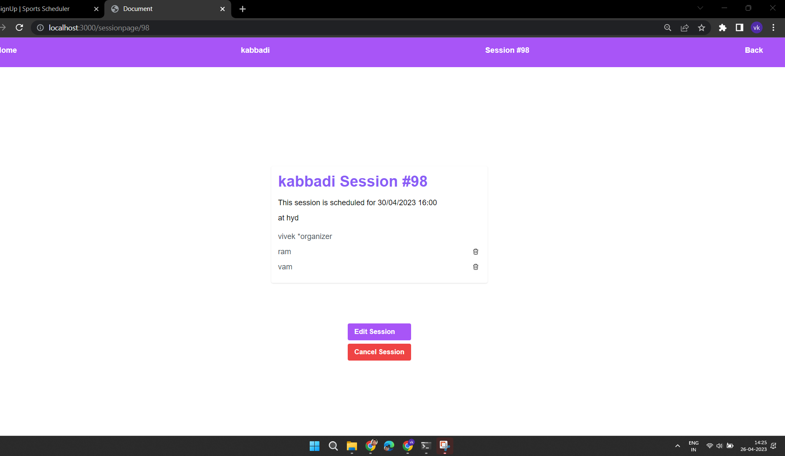

# SportsScheduler 

final capstone project for wd201 pupilfirst

[Webiste Link](https://sportsscheduler.onrender.com/)

[Youtube Link](https://www.youtube.com/watch?v=wt0wb8Bqcbc)

## Admin credentials
- vivek@gmail.com : vivekpassword
- wdcoach@gmail.com : pupilfirst
- testadmin@gmail.com : testadmin

## Home Page

## sign up page

## Sport page

 
## session page

   This project is a Sports Scheduler, a web application that allows admins to create and manage different sports that are available for scheduling, and for players to sign up, create, and join sport sessions. The application serves two personas, the Administrator and the Player, each with their own set of features. Admins can create and edit different sports available for scheduling, view reports of games played, and also create and join sport sessions just like regular players. Players, on the other hand, can sign up and sign in using their email address and password, create and join sport sessions, and cancel sessions they have created. 

